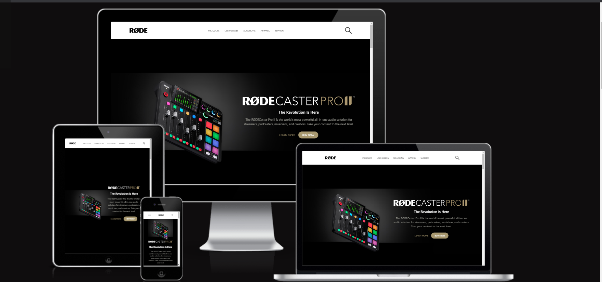

# About

## Rode Clone
Rode website Clone using tailwind css

## 🔗Demo Link
https://samhith18.netlify.app/
 

- Rode clone using  **``tailwind css``**
- completly **`responsive`**.
- learnt to build websites with short amount of time.
- compitable with any devices.
- no use of tailwind css components / template collections

## Time taken to complete this project was less than **1 hr**.
 

# screenshot

compitable with any devices.

 

desktop view
